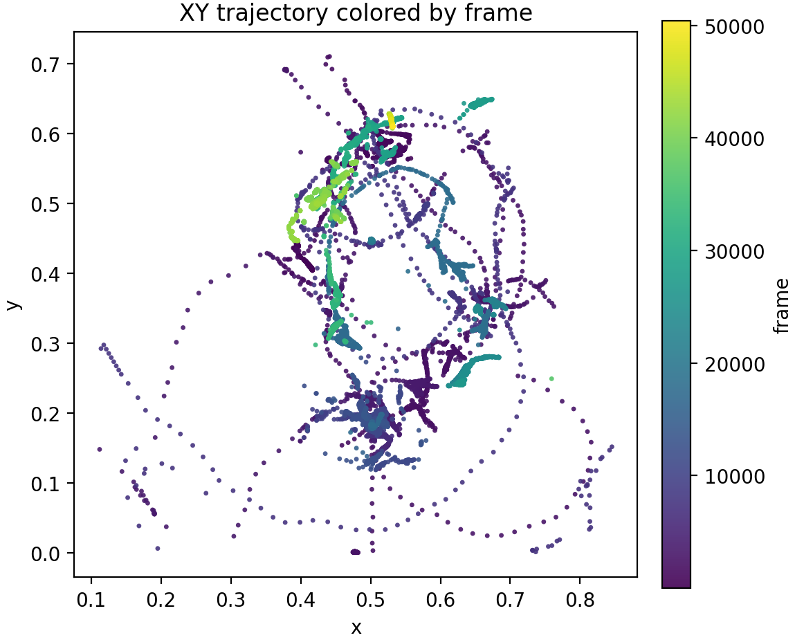

# CELEGANS Movement Analysis

This repository contains code for analyzing the movement data of C. elegans worms. It uses trajectory data to
- predict time from death using linear regression
- classify whether a worm is drug-treated or not using logistic regression, SVM, and KNN

## How to Use

1. Clone the repository
```
git clone path_to_repository
```
2. Install the required packages listed in `requirements.txt`
```
pip install -r requirements.txt
```
3. Run the desired model scripts (KNN, SVM, Logistic Regression, Death Prediction with Linear Regression) from the main directory.

```
python death_prediction_linear_regression/death_prediction.py
python Logistic_regression/logistic_regression.py
python SVM/svm_classification.py
python KNN/knn_classification.py
```

Since the feature extraction and preprocessing steps can take some time, preprocessed data and extracted features are provided in the `preprocessed_data/` and `feature_data/` directories.

## Data Structure & Model Choices

The given data is comprised of xy-trajectories of worms over time, including speed. The data was recorded with 1 frame every 2 seconds over 30 minute intervals every 6 hours. The death time of the worm is also annotated. In this project, each of these 30 minute intervals is referred to as a "segment". 

### Example Trajectory Visualization

In the following plot an example trajectory of a worm is shown, colored by frame number.



To generate this plot, run the `dataloading.ipynb` notebook.

### Amount of Samples

The original data set comprised of 104 worms in total with their full trajectory. At a later stage, 18 more worms were added, but were only used for the KNN algorithm.

## Preprocessing

Preproscessing is done in the `preprocessing.py` script. It splits the full trajectories into segments, computes the turning angle and caps speed outliers.

## Feature Extraction

Feature extraction is done in the `feature_extraction.py` script. It computes statistical features over each segment/full trajectory, such as mean speed, max speed, standard deviation of speed, mean turning angle, etc. The extracted features are saved in `feature_data/segments_features.csv` and `feature_data/full_features.csv`.

---

## KNN

## SVM

## Logistic Regression

## Death Prediction with Linear Regression